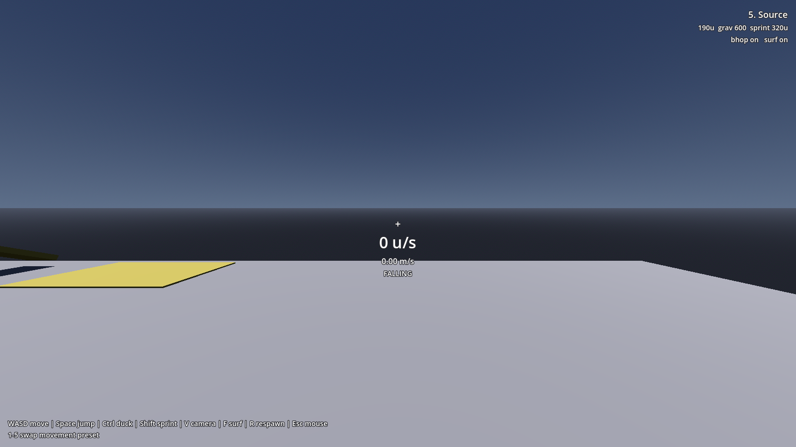
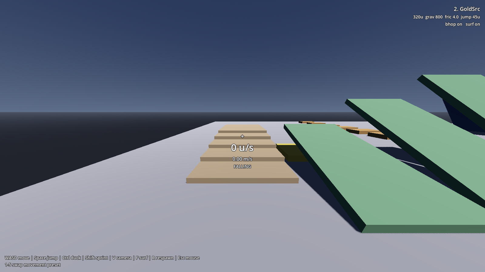
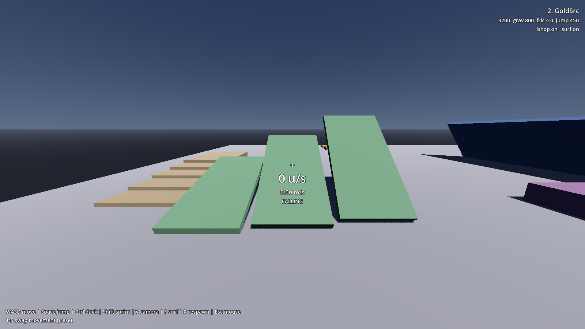
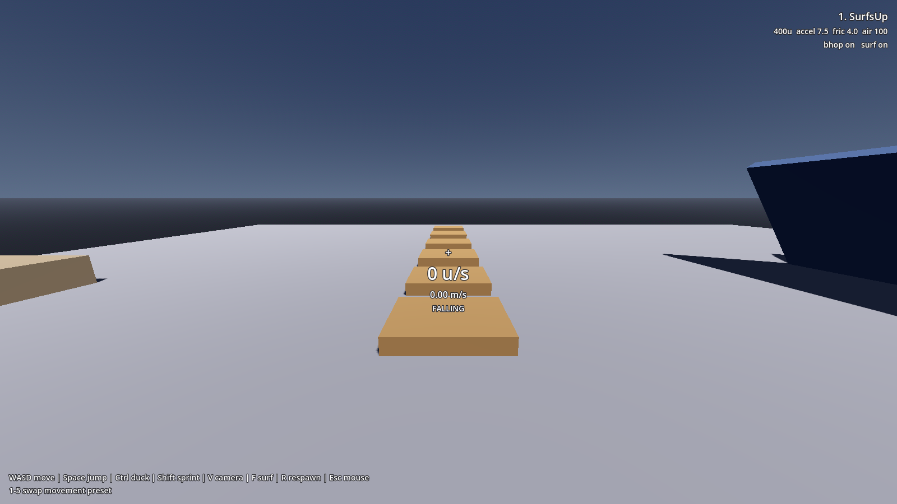
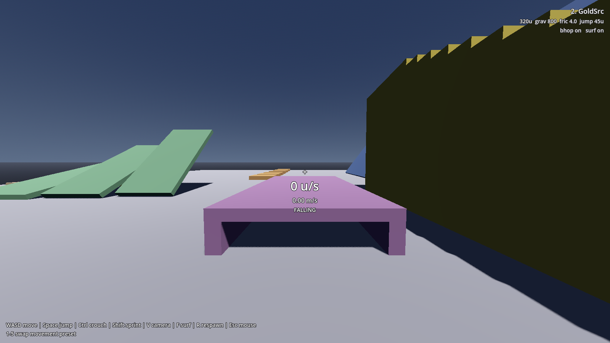
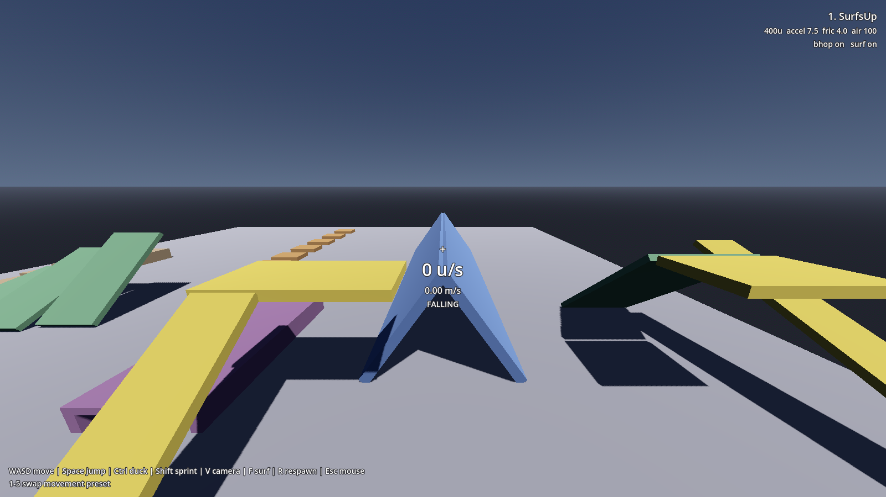
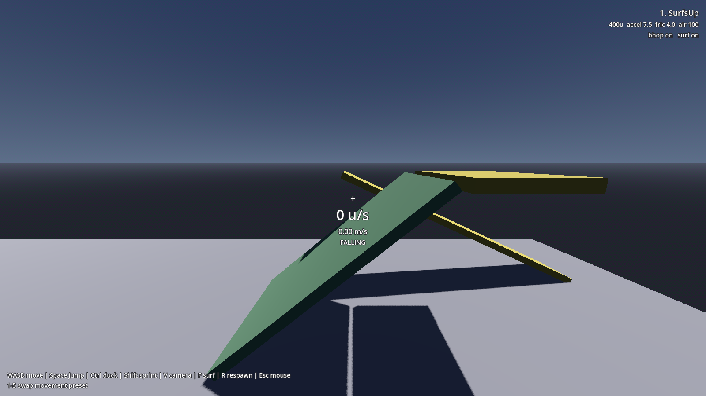

# The demo gym

`addons/SUCC/demo/test_level.tscn` is a test course, not a showcase. Every obstacle exists
to answer a specific question about the controller, and everything is sized in engine
units so the numbers mean something to anyone who has tuned a Source game.

Open it and press **F6**.


You spawn on the yellow pad at the near edge. Six lanes run away from you, one per
movement feature, built from CSG boxes with no textures so nothing distracts from the
shapes.

## The HUD



- **Under the crosshair**, your horizontal speed twice over: engine units per second in
  large text, metres per second below it. Source and Quake players think in units; Godot
  thinks in metres, and a test level should speak both.
- **Third line**, the current movement state (`IDLE`, `WALKING`, `CROUCHING`, `JUMPING`,
  `FALLING`).
- **Top right**, which preset is loaded and its headline values, so a screenshot is
  self-documenting.
- **Bottom**, the controls, read from your actual Input Map rather than hardcoded. Rebind
  `jump` and the hint updates.

## Controls

| Key | Does |
|---|---|
| WASD | Move |
| Space | Jump (hold to bunnyhop) |
| Ctrl | Duck |
| Shift | Sprint |
| V | First/third person |
| F | Toggle surf jumps |
| R | Respawn |
| 1-5 | Swap movement preset |
| Esc | Release the mouse |

## Stairs



Five steps of 12 units (0.305 m) each, rising to a landing at 1.77 m.

Twelve units is two-thirds of the 18-unit step limit every one of these engines uses.
That's deliberate: at 16 units the flight technically works but feels like wading, because
you're brushing the limit on every step. Walking up here should be smooth and unremarkable
,  if it stutters, the [step handling](movement.md#why-stairs-need-special-handling) is
broken.

To the right sits a lone **20-unit step (0.508 m)**, just above the limit. You cannot walk
onto it. You can jump onto it. That's the boundary made visible.

## Slants



Three ramps side by side at **15°, 30° and 44°**. All are under the 50° standing limit, so
all three are walkable, and your speed should be identical on all of them and on flat
ground. A ramp that speeds you up or slows you down means the movement solver is
synthesising velocity it shouldn't.

44° is deliberately just below the limit, the last angle that still counts as floor.

## Bunnyhop blocks



Six blocks with gaps that widen as you go: **64, 80, 96, 112 and 128 units**.

Hold **Space** and run. You do not need to time the presses; `bhop_buffered_jump` queues
the next jump for the landing frame.

The widening is a difficulty ramp keyed to the presets. Jump reach depends on speed and
airtime, and the five presets differ enormously:

| Preset | Reach | Clears |
|---|---|---|
| SurfsUp | 268u | all five |
| Quake | 216u | all five |
| GoldSrc | 215u | all five |
| Quake 2 | 203u | all five |
| Source | 101u | the first three |

So the early gaps work in every preset and the late ones need speed. Switch to preset 5
and you will fall short on gap four, Half-Life 2's jump is about a third as high as the
others.

## Crouch corridor



A 12 m tunnel with **40 units (1.016 m)** of headroom.

That number is chosen to sit between the two hull heights: a ducked character is 36 units
and fits; a standing character is 72 units and does not. Walk in standing and you stop at
the entrance. Hold **Ctrl** and you pass.

Release Ctrl while still inside and you stay crouched, there's no room to stand, and SUCC
retries every frame rather than giving up. Walk out the far end and you stand
automatically.

## Surf ramp



Two faces at **55°** meeting at an apex, forming a peak rather than a valley.

55° is past the 50° standing limit, so the surfaces never count as floor and you stay
permanently airborne on them, which is exactly what
[makes surfing work](movement.md#why-surfing-works). Walk up the yellow access ramp on the
left (a walkable 35°) to the platform at the top, drop onto either face, and hold a strafe
key into the slope.

The peak shape is the one real surf maps use, and it matters. On a peak you ride the
outer face with open floor beside you, so easing off the strafe key drops you off the
side. That is the skill the mode is built around. A valley would funnel you into the
bottom and hold you there, which teaches nothing.

## Slide



A **40°** chute, 11 m long, reached by another 25° access ramp.

40° is walkable but steep enough that you slide when you stop pushing, which is the middle
ground the slants don't cover.

## Reading the level as a test

Assign your own config to the player and walk the lanes. Rough expectations:

- Flat, ramps and stairs should all report the **same** speed.
- Stair rises should be uniform, with no camera jitter.
- The crouch corridor should block standing and pass ducking, regardless of preset.
- Surf should hold you on the ramp for as long as you keep strafing into it.

If your tuning breaks one of those, the lane tells you which part of the movement it was.

## Making your own

The whole level is CSG boxes in one scene file with a small script
(`addons/SUCC/demo/test_level.gd`) doing the HUD and preset switching. It's a reasonable
starting point to copy and cut down for your own game's test map.

The dimensions come from engine units divided by 39.37. If you want a 24-unit step:

```gdscript
var step: float = SUCCConfig.source_units(24.0)   # 0.6096 m
```
