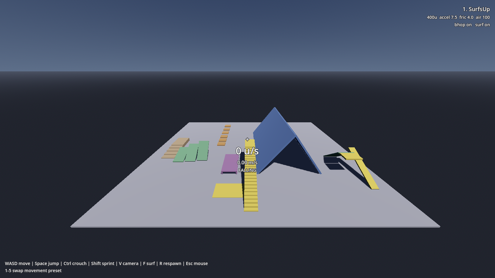

# Tutorial: your first SUCC character

By the end of this page you will have a character that walks, jumps, crouches and
bunnyhops around a test level, and you will have compared Quake movement against
Half-Life 2 movement with a single key press.

Follow it in order. Later pages explain what each value means.

You need Godot 4.6 or newer.

## Step 1: get the addon into your project

Copy the `addons/SUCC/` folder into your own project's `addons/` folder.

That's the whole install. SUCC's scripts declare a `class_name`, so Godot registers
them when it scans the folder. There is no plugin to enable in Project Settings.

## Step 2: add the movement keys

SUCC reads named actions rather than raw keys, so you decide the bindings. Open
**Project → Project Settings → Input Map** and add these seven actions:

| Action name | Key |
|---|---|
| `forward` | W |
| `back` | S |
| `left` | A |
| `right` | D |
| `jump` | Space |
| `crouch` | Ctrl |
| `sprint` | Shift |

Type the name exactly as written, press **Add**, then click the **+** beside it to
bind the key.

If you skip one, SUCC won't crash. It prints a warning naming the missing action and
disables just that movement, so you can start with `forward` and add the rest later.

## Step 3: put a character in your scene

Open any 3D scene with a floor in it. Drag `addons/SUCC/scenes/succ_character.tscn`
from the FileSystem panel into the scene tree.

Press **F6** to run the current scene. You can now walk with WASD, look with the
mouse, jump with Space and crouch with Ctrl. Press **Esc** to release the mouse.

That's a working character. The rest of this page covers what you have.

## Step 4: run the demo gym

SUCC ships with a test level that exercises every movement feature. Open
`addons/SUCC/demo/test_level.tscn` and press **F6**.

You spawn on the yellow pad. Six lanes run away from you, each testing a different
thing:

- **Stairs** (far left, tan), walk and sprint up and down. The camera and model should
  trace a smooth grade rather than snapping to each tread.
- **Slants** (green), three walkable ramps at 15°, 30° and 44°.
- **Bunnyhop blocks** (orange, centre), hold **Space** while running. Holding is
  enough; you don't need to tap it.
- **Crouch corridor** (purple), walk in standing and you stop. Hold **Ctrl** and you fit.
- **Surf ramp** (blue), the steep peak. Climb the yellow ramp, drop onto a sloped face,
  and hold a strafe key into the slope.
- **Slide** (far right), a 40° chute you slide down.

The number under the crosshair is your speed, shown twice: engine units per second on
top, metres per second below. Source players think in units; Godot thinks in metres.

[The demo gym](explanation/demo-level.md) covers what each lane tests and why it's
sized the way it is.

## Step 5: switch engines

While the demo is running, press the number keys **1** to **5**. The label in the
top-right corner changes each time.

Walk the same stretch of floor after each press:

1. **SurfsUp**, the fastest, 400 units per second.
2. **GoldSrc**, Half-Life. 320 u/s.
3. **Quake**, also 320 u/s, but a shorter character with a lower camera.
4. **Quake 2**, noticeably grippier when you stop, and you cannot gain speed by
   strafing in the air.
5. **Source**, Half-Life 2. Floaty jumps and slow on foot at 190 u/s, until you hold
   **Shift** to sprint and it jumps to 320.

Try the bunnyhop blocks on preset 5, then on preset 1. On Source you will fall short
on the later gaps; its jump is roughly a third as high.

That swapped five complete movement models without touching code. Each is a `.tres`
resource file, which is the main idea behind SUCC.

## What you built

- A character that walks, jumps, crouches and sprints.
- Movement feel living in a **config resource**, not in the controller's code.
- A test level for checking any change you make later.

## Where to go next

- To ship one of those five presets in your game: [Use a movement preset](how-to/use-a-preset.md).
- To add health, weapons or anything game-specific: [Extend SUCC for your game](how-to/extend-succ.md).
- To build your own: [Tune your own movement](how-to/tune-movement.md).
- To understand why holding jump makes you faster: [How the movement works](explanation/movement.md).
